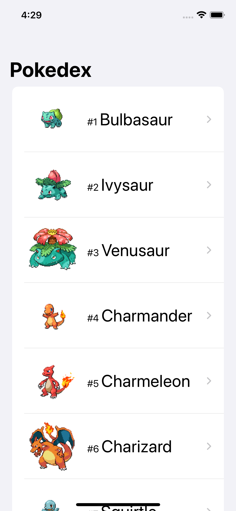

# TelepassDigitalTestIB

## General description

This project aims to develop an app, for Telepass interview process, that shows a Pokémon list with its image and name.
When a user taps on a Pokémon, the app will show a view with Pokémon’s name, image, stats, and category (fire, smoke, etc).

 ---> 

## Technology used

- **Swift 5**

- **SwiftUI**: Although the specifications required iOS dep target 11, I preferred to set it to iOS 13 so that I could use SwiftUI, a young cross-platform framework for building UI that soon or later will replace UIKit.

- **Xcode 13**

- **No external libraries or pods**: Althoug I have found convenient using CocoaPods in other projects, I followed the project's specifications using as few external libraries as possible.

- API suggested by the project's specs: [API link](https://pokeapi.co/)

## Architecture
As required, I followed the MVVM architecture, dividing the project in:

### Model
It contains the data struct of the API result and the single Pokemon.

### APIManager
It contains the logic for data fetching by API request. It adopts ViewModel's protocols to be trasparent to it.
I used URLSession for the API request. I could have used the pod Moya.

### ViewModel
It contains the observable objects to be observed by views.

### View
It contains the SwiftUI views. The main views are:
- Pokedex View: it shows the list of pokemons in order of "id". It uses infinite scrolling.
- Pokemon Details View: it shows pokemon's stats and types.
